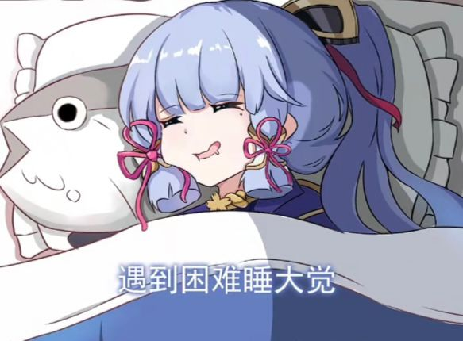

# 11.20

#### 一、so that 用法

`主` + `谓` + `so` + `adj.` + that + `从句`  
`主` + `谓` + `such` + `a/an` + `adj.` + `n. (单数)` + that + `从句`  
`主` + `谓` + `such` + `adj.` + `n. (复数)` + that + `从句`  
`主` + `谓` + `so` + `adj.` + `a/an` + `n. (单数)` + that + `从句`  
`主` + `谓` + `so` + `many/much/few/little` + `n.` + that + `从句`  

#### 二、变化

vary `v.` `变化画、多样化`  
variety `n.` `多种类` a variety of = various  
various `adj.` `各种各样的`  
variable `adj.` `多变的`  
invariable `adj.` `不变的、固定的`  
variability `n.` `可变性`  
variation `n.` `变化、变量`  

#### 三、

#### 十、与……不一样

be different from  
be unlike  
